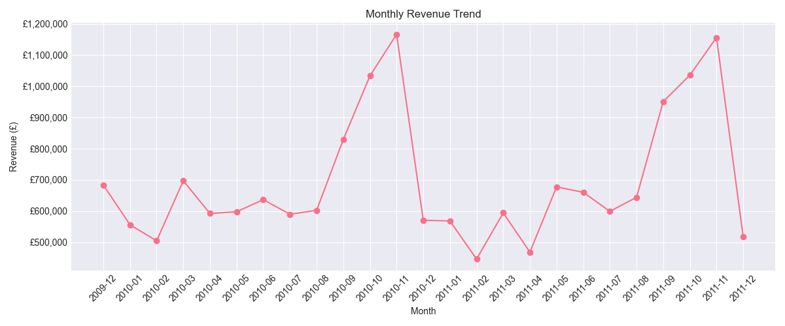
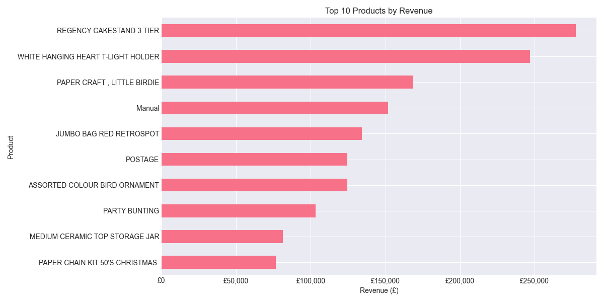
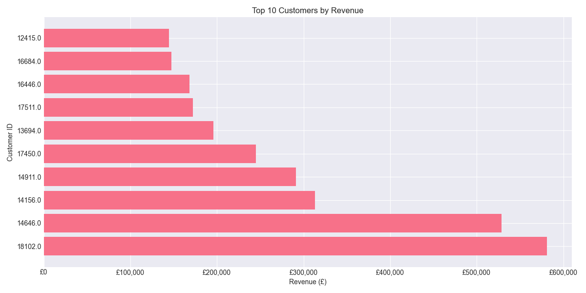

# 📦 Online Retail Sales Analysis

## Overview
This project analyzes online retail transactions from a UK-based e-commerce store (2009–2011). The goal is to understand customer behavior, product performance, and sales trends, and to generate actionable business insights.

---

## Dataset
The dataset is based on the **Online Retail II** dataset (UCI / Kaggle).

Main fields:
- Invoice — unique transaction ID (C indicates cancellation)
- StockCode — product identifier
- Description — product name
- Quantity — number of items purchased
- InvoiceDate — transaction date and time
- Price — unit price (£)
- Customer ID — unique customer identifier
- Country — customer location

Date range: 2009–2011  
Total records: ~1,000,000 transactions

---

## Tools & Technologies
- Python (pandas, numpy)
- Data visualization (matplotlib, seaborn)
- Jupyter Notebook / VS Code

---

## Main Business Questions & Insights

### 1. How do sales evolve over time?
- Revenue varies significantly across months
- Clear seasonality with peak periods during the year

### 2. Which products generate the most revenue?
- A small number of products account for a large share of total revenue
- High-revenue products are not always the most frequently sold

### 3. What is the customer purchasing behavior?
- Customer spending is highly concentrated
- A small group of customers generates most of the revenue

### 4. What are the peak purchasing times?
- Most transactions occur during working hours
- Peak activity between late morning and early afternoon

### 5. How does performance vary by country?
- The United Kingdom dominates sales
- Other countries contribute smaller shares of revenue

### 6. What are the order patterns?
- Order sizes vary significantly
- Some customers place high-value bulk orders

---

## Key Metrics

| Metric | Value |
|-------|------|
| Total Transactions | ~1,000,000 |
| Unique Customers | ~4,000 |
| Countries | 30+ |
| Time Period | 2009–2011 |
| Main Market | United Kingdom |

---

## Business Recommendations

1. Focus on high-value customers through loyalty programs  
2. Promote top-performing products  
3. Leverage seasonal trends for marketing campaigns  
4. Expand international sales opportunities  
5. Increase average order value through bundling and upselling  

---

## 📈 Sample Visualizations

### Monthly Revenue Trend

### Top Products

### Top Customers

## How to Run the Project

1. Download the dataset from Kaggle and place it in the `data/` folder  
2. Install dependencies: pip install -r requirements.txt 

3. Run the notebooks in order:
- 01_data_loading_exploration.ipynb  
- 02_data_cleaning.ipynb  
- 03_exploratory_analysis.ipynb  
- 04_insights_and_recommendations.ipynb  

---

## Skills Demonstrated

- Data cleaning and preprocessing using pandas  
- Exploratory data analysis and visualization  
- Customer and product behavior analysis  
- Business insight generation  
- Structured end-to-end data analysis workflow  

---

## Limitations

- Dataset is historical and may not reflect current trends  
- Missing customer data may affect analysis  
- External factors (marketing, economy) are not included  

---

## Conclusion

This project demonstrates a complete data analysis pipeline from raw data to actionable insights. It highlights the ability to analyze real-world data and translate it into meaningful business recommendations.

---

## 📫 Contact

- 🔗 [LinkedIn](https://www.linkedin.com/in/rafik-bouakaz-1aba893a0/)
- 💻 [GitHub Project](https://github.com/rafikbouakaz/Online_Retail_Sales_Analysis)
---

*Dataset source: UCI Machine Learning Repository — Online Retail II*